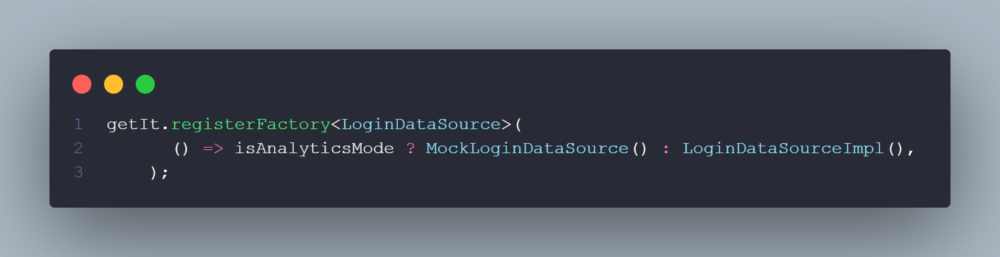

# Analytics_app

The analytics_app package for Flutter is a useful tool for developers who want to test and visualize information about their applications.


With this tool, you can create and manipulate mocked data source returns, allowing developers to test different return scenarios without the need for server or database connection. Additionally, the package also offers information about the application's performance and other relevant statistics to help developers better understand their application's behavior.
<br>
<br>

>  ## Note: To use the data source return handling feature, it is necessary to use named route navigation.
<br>
<br>

#  How to use
To use the package in your Flutter project, simply add the dependency to your pubspec.yaml:

```yaml
dependencies:
  analytics_app: ^0.1.0
```


Then, import the package in your **main.dart** file:

```dart
import 'package:analytics_app/analytics_app.dart';
```

Finally, Wrap your MaterialApp widget with the AnalyticsApp widget, passing the isActivateAnalytics parameter as true. You can also pass the MaterialApp widget as a parameter to the materialApp parameter of the AnalyticsApp widget. This way, you can add the navigatorObservers parameter to the MaterialApp widget, which is necessary for the package to work properly.

```dart
return AnalyticsApp(
 // Pass true to activate the analytics mode.
    isActivateAnalytics: iActivateAnalyticsMode,
// Pass the MaterialApp widget as a parameter to the materialApp parameter and add the navigatorObservers parameter to the MaterialApp widget. 
    materialApp: (observer) => MaterialApp(
        /// Add the observer to the MaterialApp.
        navigatorObservers: [observer],

        ....
    ),
);

```

Now you can create and manipulate mocked data source returns, as well as view performance information and other relevant statistics for your application.
 
<br>
<br>

# Creating a Mocked data source
To create a mocked data source, simply create a class that extends the [MockDataSource](lib/src/mock_data_source.dart) class and implement the real abstract class.

```dart
/// The method that will be called when the data source is called.
class MockLoginDataSource extends MockDataSource implements LoginDataSource {
  MockLoginDataSource({
   /// always add the name of the current route in this parameter, 
   /// analytics updates the name of the route as an identifier for the  
   /// Mockdatasources
    super.routeName = '/login',

    super.friendlyName = 'Login Data Source',
  });

/// The possible answers that the data source can return.
/// this list is used when the app is in analytics mode.
  @override
  List<PossibleAnswer> get possibleAnswers => [
        PossibleAnswer(
          id: 1,
          label: 'User Success',
          description: 'return a success',
        ),
        PossibleAnswer(
          id: 2,
          label: 'User Error',
          description: 'return a default error',
        ),
        PossibleAnswer(
          id: 3,
          label: 'User Not Found',
          description: 'return a not found error',
        ),
      ];

  @override
  Future<String> getUser({
    required String userName,
    required String password,
  }) async {
    await Future.delayed(const Duration(seconds: 2));

    /// Get the selected answer by [returnSelected] property.
    /// check if the answer selected by the user matches some of the 
    ///options created by you
    if (returnSelected?.id == 1) {

     /// Register the request and response in history requests.   
      registerRequest(
        name: 'Get user',
        request: 'getUser : $userName : $password',
        response: 'User Success',
      );
      return 'User Success';
    } else if (returnSelected?.id == 3) {
      registerRequest(
        request: 'getUser : $userName : $password',
        response: 'User Not Found',
        name: 'Get user',
      );
      return 'User Not Found $userName $password';
    } else if (returnSelected?.id == null) {
      return 'Success User';
    } else {
      registerRequest(
        name: 'Get user',
        request: 'getUser : $userName : $password',
        response: 'User Error $userName $password',
      );

    /// If the answer selected by the user does not match any of the
    /// options created by you, the default answer will be returned.
      return 'User Error $userName $password';
    }
  }
}

```


<br>
<br>

# Injecting the mocked data source

Here's an example of how to create your dependency injections automatically switching between a real and mock data source

Use the same condition you chose to activate the AnalyticsMode mode and decide which DataSource instance should be registered




<br>
<br>
<br>

# Buy me a coffee.
<div align="center">
<a href="https://www.buymeacoffee.com/lucasmatheusdev" target="_blank"></a>
